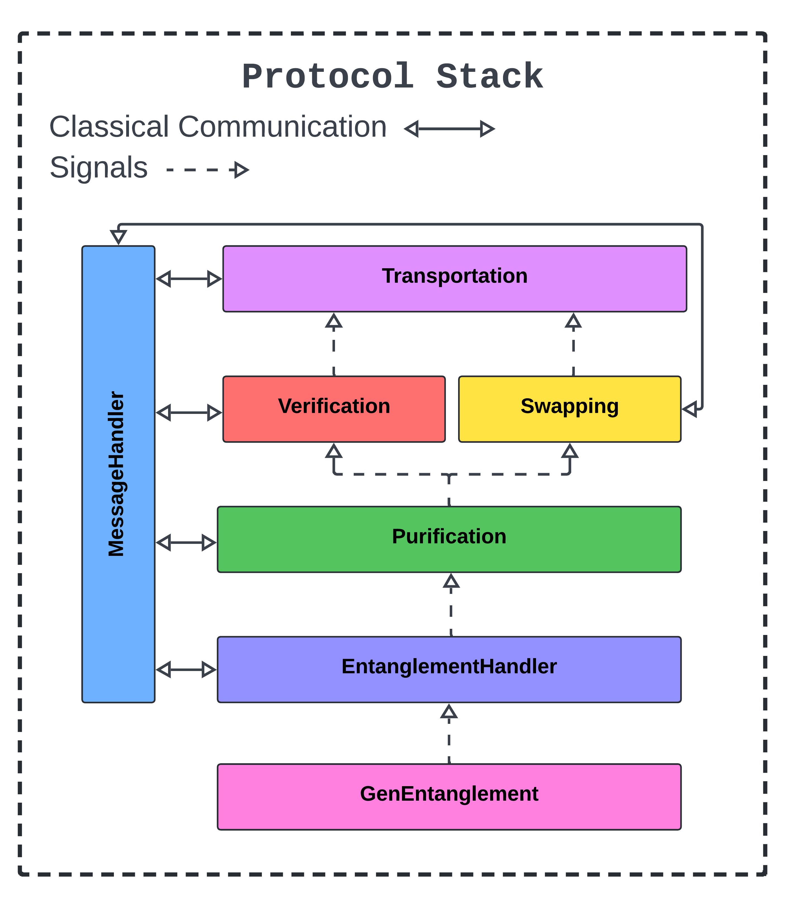
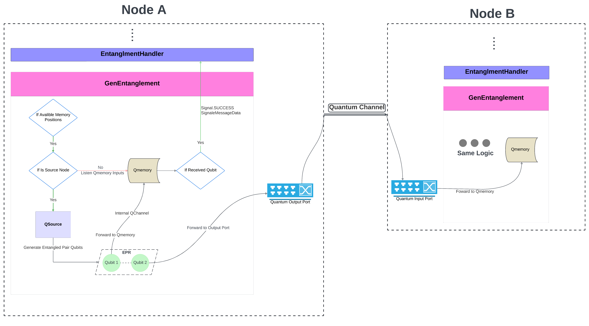

# Protocols

## Overview
The over all protocol stack is shown in the figure below. The protocols are implemented in the following order:

    

## GenEntanglement Protocol Workflow
The GenEntanglement protocol is responsible for generating entanglement between two nodes. The protocol is as follows:

    

Each node will run its own `GenEntanglement` protocol. 
The protocol will constantly generate entanglement pairs until no available memory position left. 
For each qubit received in Qmemory, the protocol will send a `Signal.SUCCESS` signal via `self.send_signal()` to `EntanglementHandler` layer. 
Once all pairs are generated, the protocol will then wait for the `EntanglementHandler` layer for re-generating new entanglement pairs. 
The protocol will then generate new entanglement based on the memory position sent by `EntanglementHandler` layer.